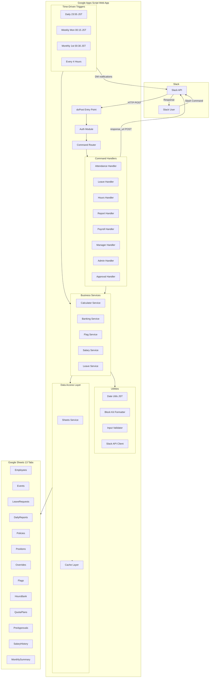
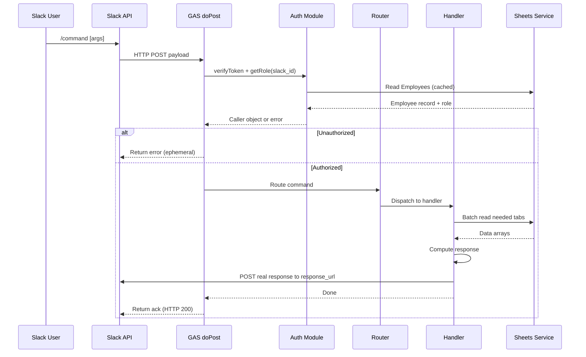
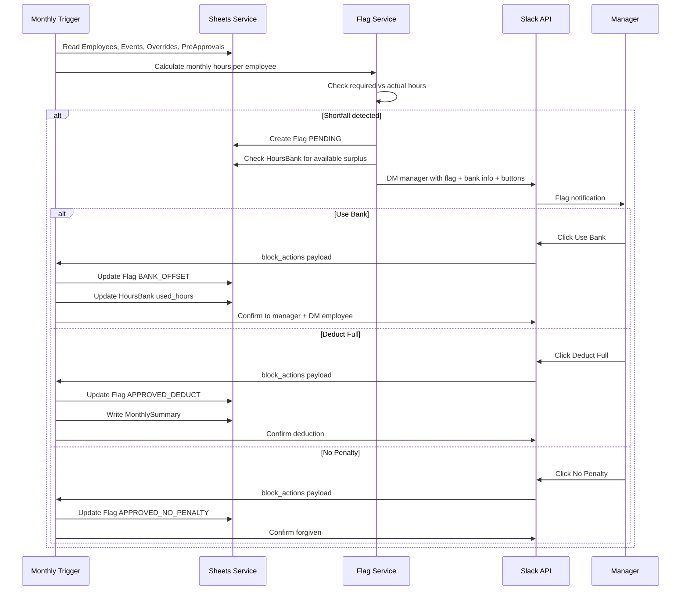
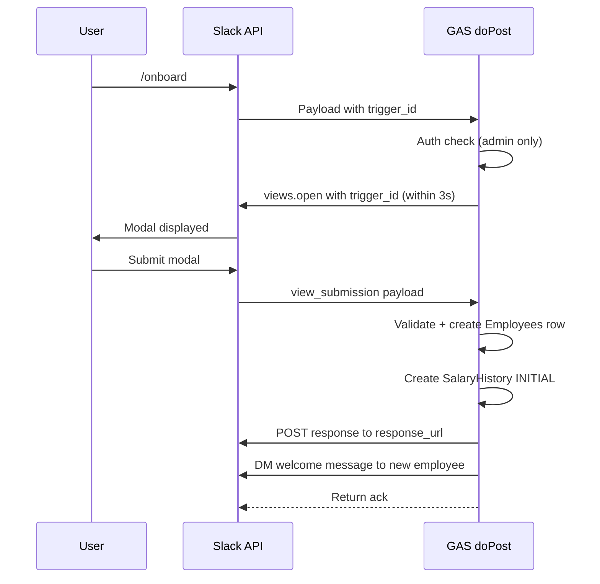
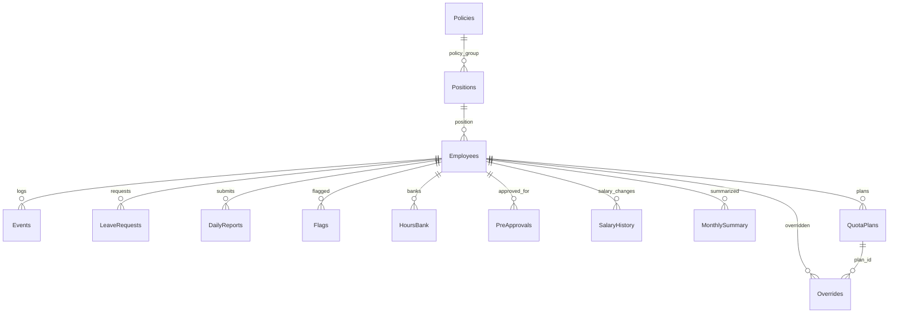

# Technical Design Document — Slack HR Bot

## Overview

**Purpose**: This system delivers a complete HR management solution to the company's 10-15 Nepal-based contractors, enabling attendance tracking, leave management, hours enforcement, payroll calculation, and employee lifecycle management — entirely through Slack slash commands at zero infrastructure cost.

**Users**: All contractors (employees), team leads (managers), and the CEO/admin interact via Slack. Admins also configure seed data directly in Google Sheets.

**Impact**: Replaces manual timekeeping and payroll spreadsheets with an automated, auditable system.

### Goals
- Zero-cost stack: Slack Free Plan + Google Apps Script + Google Sheets
- Real-time attendance tracking via Slack slash commands
- Automated 3-level hours enforcement with manager-controlled flag resolution
- Accurate payroll calculation with append-only salary audit trail
- Self-service views for employees; consolidated dashboards for managers

### Non-Goals
- JIRA/GitHub integration for daily report verification (Phase 2 — deferred)
- Mobile app or web UI (Slack is the sole interface)
- Multi-workspace or multi-company support
- Real-time collaboration features beyond Slack's native capabilities
- Slack HMAC-SHA256 signature verification (GAS limitation — see research.md)

## Architecture

### Architecture Pattern & Boundary Map

**Selected pattern**: Monolithic Google Apps Script Web App with layered internal organization (Router → Handlers → Services → Data Access). Single deployment endpoint handles all Slack payloads.

**Rationale**: Zero cost, no infrastructure management, sufficient for 15-user scale. The 6-minute execution limit and 30 concurrent execution cap are acceptable constraints at this scale.



**Domain boundaries**:
- **Auth**: Identity resolution + permission checking (cross-cutting)
- **Handlers**: Command parsing + response formatting (presentation layer)
- **Services**: Business logic + calculations (domain layer)
- **Data Access**: Sheet reads/writes + caching (persistence layer)
- **Triggers**: Scheduled automation (background processes)
- **Utils**: Shared utilities (cross-cutting)

### Technology Stack

| Layer | Choice / Version | Role in Feature | Notes |
|-------|------------------|-----------------|-------|
| Frontend / UI | Slack Free Plan + Block Kit | Slash commands, interactive buttons, modals | 50 blocks/message, 100/modal |
| Backend | Google Apps Script (V8 runtime) | Serverless request handling, business logic | 6-min timeout, 30 concurrent |
| Data / Storage | Google Sheets (13 tabs) | Persistent database | 10M cell limit; ~25K rows/year |
| Caching | GAS CacheService | Config table caching (Policies, Positions, Employees) | 100KB/value, 6hr TTL max |
| Messaging | Slack Web API (UrlFetchApp) | Deferred responses, DMs, channel posts, modals | 20K URL fetch calls/day |
| Scheduling | GAS Time-Driven Triggers | Daily/weekly/monthly checks, reminders | 90 min/day total trigger runtime |
| Concurrency | GAS LockService | Script-level write locking | tryLock(10000) pattern |

## System Flows

### Flow 1: Slash Command Lifecycle (All Commands)



**Key decisions**: Auth check happens before routing. Real response posted to response_url before returning the HTTP ack.

**Important: Best-effort ack pattern.** In GAS, `doPost()` returns the HTTP response only after the entire function completes. The ack does NOT arrive before processing — it arrives after. If total execution exceeds 3 seconds (common on cold starts: sheet reads take 2-8 seconds), Slack shows "operation_timeout" to the user. However, the response_url POST still delivers the real response (valid for 30 minutes). Mitigations:
- **Keep-alive trigger**: A time-driven trigger every 5 minutes calls a no-op function to prevent cold starts
- **Modal commands** (`/onboard`, `/edit-employee`, `/report`): Call `views.open` FIRST (acts as implicit ack to Slack), then do sheet work in the `view_submission` handler
- **Acceptable UX**: For an internal 15-person tool, occasional "operation_timeout" followed by the actual response is acceptable

### Flow 2: Leave Request + Manager Approval

```mermaid
sequenceDiagram
    participant E as Employee
    participant S as Slack API
    participant G as GAS
    participant M as Manager

    E->>S: /request-leave 2026-04-02
    S->>G: Payload
    G->>G: Create LeaveRequest PENDING
    G->>S: POST to response_url: Request created
    G->>S: DM to manager with buttons
    S->>M: Leave request notification

    alt Approve Paid
        M->>S: Click Approve Paid
        S->>G: block_actions payload
        G->>G: Update LeaveRequest APPROVED
        G->>G: Deduct leave balance, credit 8h
        G->>S: Update original message
        G->>S: DM to employee: Approved
    else Approve Unpaid
        M->>S: Click Approve Unpaid
        S->>G: block_actions payload
        G->>G: Update LeaveRequest APPROVED, 0h credit
        G->>S: Update message + DM employee
    else Reject
        M->>S: Click Reject
        S->>G: block_actions payload
        G->>G: Update LeaveRequest REJECTED
        G->>S: Update message + DM employee
    end
```



### Flow 3: Monthly Flag Creation + Resolution



### Flow 4: Modal Commands (Onboard / Edit / Report)



**Key decision**: `views.open` must be called immediately using `trigger_id` (expires in 3 seconds). Sheet reads for pre-populating modals must use cached data.

## Requirements Traceability

| Requirement | Summary | Components | Interfaces | Flows |
|-------------|---------|------------|------------|-------|
| 1.1, 1.2, 1.3 | Request verification | Auth Module | verifyToken() | Flow 1 |
| 2.1–2.7 | RBAC inclusive hierarchy | Auth Module | getRole(), requireRole() | Flow 1 |
| 3.1–3.3 | Deferred response | DoPost, SlackUtil | postToResponseUrl() | Flow 1 |
| 4.1–4.10 | Attendance tracking | Attendance Handler, Sheets Service | handleClockIn/Out/Break/Back/Status() | Flow 1 |
| 5.1–5.3 | Cross-midnight handling | Calculator Service, Daily Trigger | getDailyHours(), checkOpenSessions() | — |
| 6.1–6.4 | Positions & policy groups | Sheets Service, Cache Layer | resolveHourRequirements() | — |
| 7.1–7.6 | 3-level hours enforcement | Flag Service, Calculator Service | checkDailyShortfall(), checkWeeklyShortfall(), checkMonthlyShortfall() | Flow 3 |
| 8.1–8.7 | Flag resolution | Flag Service, Manager Handler | resolveFlag() | Flow 3 |
| 9.1–9.6 | Surplus banking | Banking Service | approveSurplus(), checkExpiry() | — |
| 10.1–10.10 | Leave management | Leave Handler, Leave Service | handleLeaveRequest(), approveLeave() | Flow 2 |
| 11.1–11.4 | Leave accrual | Leave Service, Monthly Trigger | accrueLeave() | — |
| 12.1–12.6 | Daily reports | Report Handler | handleReportSubmit(), handleReportView() | Flow 4 |
| 13.1–13.11 | Payroll calculation | Calculator Service, Salary Service | calculatePayroll(), getEffectiveSalary() | — |
| 14.1–14.5 | Salary history | Salary Service, Admin Handler | updateSalary(), getSalaryHistory() | — |
| 15.1–15.6 | Quota redistribution | Approval Handler | handleAdjustQuota() | — |
| 16.1–16.6 | Pre-approved absences | Approval Handler | handleApproveAbsence() | — |
| 17.1–17.5 | Onboarding | Admin Handler | handleOnboard() | Flow 4 |
| 18.1–18.5 | Offboarding | Admin Handler | handleOffboard() | — |
| 19.1–19.5 | Employee editing | Admin Handler | handleEditEmployee() | Flow 4 |
| 20.1–20.6 | Team leave calendar | Leave Handler | handleTeamLeave() | — |
| 21.1–21.4 | Role-aware help | Hours Handler | handleHelp() | — |
| 22.1–22.5 | Hours self-service | Hours Handler, Calculator Service | handleViewHours() | — |
| 23.1–23.5 | Manager team views | Manager Handler | handleTeamHours/Flags/Bank/Reports() | — |
| 24.1–24.4 | Time-driven triggers | Daily/Weekly/Monthly/Reminder Triggers | runDailyCheck(), runWeeklyCheck(), runMonthlyCheck(), runReminders() | Flow 3 |
| 25.1–25.7 | Channel & privacy | SlackUtil, FormatUtil | postToChannel(), sendDM() | — |
| 26.1–26.4 | Concurrency & performance | Sheets Service, Lock, Cache | acquireLock(), batchRead(), cacheConfig() | — |
| 27.1–27.5 | Validation & errors | ValidateUtil | validateDate(), validateEmployee(), validateUnique() | — |

## Components and Interfaces

### Component Summary

| Component | Domain/Layer | Intent | Req Coverage | Key Dependencies | Contracts |
|-----------|-------------|--------|--------------|------------------|-----------|
| DoPost Entry | Routing | Single endpoint for all Slack payloads | 1, 3 | Auth, Router (P0) | — |
| Auth Module | Cross-cutting | Identity + permission checking | 1, 2 | Sheets Service (P0) | Service |
| Command Router | Routing | Dispatch payloads to correct handler | 3 | Auth (P0), All Handlers (P0) | Service |
| Attendance Handler | Commands | /in, /out, /break, /back, /clock-status | 4, 5 | Sheets Service (P0), Calculator (P1) | Service |
| Leave Handler | Commands | /request-leave, /balance, /team-leave | 10, 11, 20 | Leave Service (P0), Sheets Service (P0) | Service |
| Hours Handler | Commands | /hours, /my-bank, /hr-help | 21, 22 | Calculator (P0), Banking (P1) | Service |
| Report Handler | Commands | /report (modal + views) | 12 | Sheets Service (P0), SlackUtil (P0) | Service |
| Payroll Handler | Commands | /payroll, /team-payroll, /salary-history | 13, 14 | Calculator (P0), Salary Service (P0) | Service |
| Manager Handler | Commands | /team-hours, /team-flags, /team-bank, /team-reports | 23 | Flag Service (P1), Calculator (P0) | Service |
| Approval Handler | Commands | /approve-surplus, /approve-absence, /adjust-quota | 9, 15, 16 | Banking (P0), Sheets Service (P0) | Service |
| Admin Handler | Commands | /onboard, /offboard, /edit-employee | 17, 18, 19 | Sheets Service (P0), Salary Service (P1), SlackUtil (P0) | Service |
| Calculator Service | Business Logic | Hours computation, payroll math, pro-rata | 5, 7, 13 | Date Utils (P0) | Service |
| Banking Service | Business Logic | Surplus banking, offset, expiry | 8, 9 | Sheets Service (P0) | Service |
| Flag Service | Business Logic | Shortfall detection + resolution | 7, 8 | Calculator (P0), Banking (P1) | Service |
| Salary Service | Business Logic | getEffectiveSalary, salary history | 13, 14 | Sheets Service (P0) | Service |
| Leave Service | Business Logic | Accrual, balance, approval logic | 10, 11 | Sheets Service (P0) | Service |
| Sheets Service | Data Access | All Google Sheets read/write operations | 26 | CacheService (P1), LockService (P0) | Service, State |
| SlackUtil | Utility | Slack API calls (messages, modals, DMs) | 3, 25 | UrlFetchApp (P0) | Service |
| FormatUtil | Utility | Block Kit message construction | 25 | — | — |
| DateUtil | Utility | JST conversion, date math, period helpers | 5 | — | — |
| ValidateUtil | Utility | Input validation | 27 | — | — |
| Daily Trigger | Background | End-of-day checks | 5, 7, 24 | Flag Service (P0), Sheets Service (P0) | Batch |
| Weekly Trigger | Background | Weekly summary | 7, 24 | Flag Service (P0) | Batch |
| Monthly Trigger | Background | Payroll, accrual, expiry | 7, 9, 11, 24 | Flag/Banking/Leave Services (P0) | Batch |
| Reminder Trigger | Background | Pending item reminders | 24 | Sheets Service (P0), SlackUtil (P0) | Batch |

---

### Cross-Cutting Layer

#### Auth Module

| Field | Detail |
|-------|--------|
| Intent | Verify request authenticity and resolve caller identity + role |
| Requirements | 1.1, 1.2, 1.3, 2.1–2.7 |

**Responsibilities & Constraints**
- Verify Slack verification token from payload (not HMAC — GAS limitation)
- Look up caller in Employees sheet by slack_id
- Derive role: admin > manager > employee (inclusive)
- Enforce minimum role requirements per command
- Scope manager commands to direct reports only

**Dependencies**
- Inbound: DoPost — all requests pass through auth (P0)
- Outbound: Sheets Service — Employees tab lookup (P0)
- External: Slack verification token from payload (P0)

**Contracts**: Service [x]

##### Service Interface
```javascript
/**
 * @typedef {Object} CallerInfo
 * @property {string} user_id - e.g. "EMP001"
 * @property {string} slack_id - e.g. "U04ABCDEF"
 * @property {string} name
 * @property {string} role - "employee" | "manager" | "admin"
 * @property {string} manager_id
 * @property {boolean} is_admin
 * @property {string} position
 * @property {string} status - "ACTIVE" | "INACTIVE"
 */

/**
 * Verify the Slack verification token.
 * @param {Object} payload - Parsed doPost payload
 * @returns {boolean} - true if token matches
 * @throws {Error} "Invalid request" if token mismatch
 */
function verifyToken(payload) {}

/**
 * Resolve caller identity and role from Employees sheet.
 * @param {string} slackUserId - Slack user ID from payload
 * @returns {CallerInfo}
 * @throws {Error} "You're not registered" if not found
 * @throws {Error} "Your account is inactive" if INACTIVE
 */
function getRole(slackUserId) {}

/**
 * Enforce minimum role requirement.
 * @param {CallerInfo} caller
 * @param {string} minimumRole - "employee" | "manager" | "admin"
 * @returns {CallerInfo} - same caller if authorized
 * @throws {Error} Role-specific denial message
 */
function requireRole(caller, minimumRole) {}

/**
 * Check if caller can act on target employee.
 * @param {CallerInfo} caller
 * @param {string} targetUserId
 * @returns {boolean}
 */
function canAccessEmployee(caller, targetUserId) {}
```
- Preconditions: Valid Slack payload with token field
- Postconditions: Returns CallerInfo with resolved role, or throws descriptive error
- Invariants: Role hierarchy is always admin > manager > employee (inclusive)

**Implementation Notes**
- Uses verification token (not HMAC) due to GAS header limitation (see research.md)
- Employees data cached in CacheService with 10-minute TTL
- hasDirectReports() scans Employees for any row where manager_id = caller.user_id

---

#### Command Router

| Field | Detail |
|-------|--------|
| Intent | Parse Slack payload type and dispatch to correct handler |
| Requirements | 3.1–3.3 |

**Responsibilities & Constraints**
- Distinguish payload types: slash command, block_actions (buttons), view_submission (modals)
- For slash commands: route by `command` field
- For interactions: route by `type` + `action_id` or `callback_id`
- Modal commands use trigger_id (must call views.open immediately)

**Contracts**: Service [x]

##### Service Interface
```javascript
/**
 * Main entry point for all Slack payloads.
 * @param {Object} e - GAS doPost event object
 * @returns {TextOutput} - ContentService ack response
 */
function doPost(e) {}

/**
 * Route slash command to handler.
 * @param {string} command - e.g. "/in", "/request-leave"
 * @param {CallerInfo} caller
 * @param {string} text - command arguments
 * @param {string} responseUrl
 * @param {string} triggerId - for modal commands
 */
function routeSlashCommand(command, caller, text, responseUrl, triggerId) {}

/**
 * Route interactive payload (buttons, modals).
 * @param {Object} payload - Parsed JSON from interaction
 */
function routeInteraction(payload) {}
```

---

### Command Handlers Layer

#### Attendance Handler

| Field | Detail |
|-------|--------|
| Intent | Process /in, /out, /break, /back, /clock-status commands |
| Requirements | 4.1–4.10, 5.1 |

**Responsibilities & Constraints**
- Enforce attendance state machine with 3 states: `IDLE`, `CLOCKED_IN`, `ON_BREAK`
- State derived from last event: no event/OUT → IDLE, IN/BREAK_END → CLOCKED_IN, BREAK_START → ON_BREAK
- Valid transitions: IDLE→/in→CLOCKED_IN, CLOCKED_IN→/out→IDLE, CLOCKED_IN→/break→ON_BREAK, ON_BREAK→/back→CLOCKED_IN
- All other transitions rejected with descriptive error messages
- Multiple sessions per day supported: after /out (IDLE), employee can /in again
- Append events to Events tab (never edit/delete)
- Calculate session hours on /out (sum all sessions minus all breaks for the day)
- Cross-midnight: all hours count toward clock-in date
- **Idempotency**: Reject duplicate events within a 60-second window (same user + same action type). Prevents double-entry when user retries after a Slack timeout message.

**Dependencies**
- Outbound: Sheets Service — Events tab append (P0)
- Outbound: Calculator Service — session hours on /out (P1)
- Outbound: SlackUtil — post to response_url and #attendance channel (P0)

**Contracts**: Service [x]

##### Service Interface
```javascript
/**
 * @param {CallerInfo} caller
 * @param {string} responseUrl
 */
function handleClockIn(caller, responseUrl) {}
function handleClockOut(caller, responseUrl) {}
function handleBreakStart(caller, responseUrl) {}
function handleBreakEnd(caller, responseUrl) {}
function handleStatus(caller, responseUrl) {}
```
- Preconditions: Caller is active employee; valid state for action
- Postconditions: Event appended; public message to #attendance (except /clock-status)
- Invariants: Events tab is append-only

---

#### Admin Handler

| Field | Detail |
|-------|--------|
| Intent | Process /onboard, /offboard, /edit-employee |
| Requirements | 17.1–17.5, 18.1–18.5, 19.1–19.5 |

**Responsibilities & Constraints**
- /onboard: open modal → validate → create Employees + SalaryHistory rows → welcome DM
- /offboard: show settlement preview → confirm → set INACTIVE + cancel plans + final summary
- /edit-employee: open pre-populated modal → validate changes → update + log to #hr-alerts
- Auto-generate user_id (EMP + next sequential number)
- Unique constraints on slack_id, email

**Dependencies**
- Outbound: Sheets Service — Employees, SalaryHistory, QuotaPlans writes (P0)
- Outbound: Salary Service — settlement calculation for offboard (P0)
- Outbound: Calculator Service — pro-rata calculation for offboard (P0)
- Outbound: SlackUtil — modals, DMs, channel posts (P0)

**Contracts**: Service [x]

##### Service Interface
```javascript
/**
 * Open onboard modal.
 * @param {string} triggerId - Slack trigger_id (expires in 3s)
 * @param {CallerInfo} caller - Must be admin
 */
function handleOnboardModal(triggerId, caller) {}

/**
 * Process onboard modal submission.
 * @param {Object} viewPayload - Modal submission data
 * @param {CallerInfo} caller
 * @returns {{success: boolean, error: string|null, employee: Object|null}}
 */
function handleOnboardSubmit(viewPayload, caller) {}

/**
 * Show offboard settlement preview and handle confirmation.
 * @param {CallerInfo} caller
 * @param {string} targetEmployeeRef - @mention, email, or EMP-id
 * @param {string} responseUrl
 */
function handleOffboard(caller, targetEmployeeRef, responseUrl) {}

/**
 * Open edit-employee modal with pre-populated fields.
 * @param {string} triggerId
 * @param {CallerInfo} caller
 * @param {string} targetEmployeeRef
 */
function handleEditEmployeeModal(triggerId, caller, targetEmployeeRef) {}
```

---

### Business Services Layer

#### Calculator Service

| Field | Detail |
|-------|--------|
| Intent | Pure computation: hours, payroll, pro-rata, deficits |
| Requirements | 5.1, 7.1–7.4, 13.1–13.9 |

**Responsibilities & Constraints**
- All functions are pure (input → output, no side effects, no sheet access)
- Hours calculation: work_time - break_time, cross-midnight aware
- Payroll: hourly_rate, deficit, deduction (rounded UP to nearest NPR), final_salary
- Pro-rata: join/termination mid-month scaling by calendar days
- Salary blending: when multiple salary changes in same month

**Dependencies**
- Inbound: All handlers and triggers (P0)
- Outbound: DateUtil — JST date math (P0)

**Contracts**: Service [x]

##### Service Interface
```javascript
/**
 * @typedef {Object} HoursResult
 * @property {number} workedHours
 * @property {number} breakHours
 * @property {number} netHours
 */

/**
 * Calculate hours for a single day from events.
 * Cross-midnight: all hours attributed to the IN event's date.
 * @param {Array<Array>} events - Events rows for the user
 * @param {string} date - YYYY-MM-DD (JST)
 * @returns {HoursResult}
 */
function getDailyHours(events, date) {}

/**
 * Calculate hours for a week (Mon-Sun).
 * @param {Array<Array>} events
 * @param {string} weekStartDate - YYYY-MM-DD (Monday)
 * @returns {{dailyBreakdown: Object<string, HoursResult>, weekTotal: number}}
 */
function getWeeklyHours(events, weekStartDate) {}

/**
 * Calculate hours for a month.
 * @param {Array<Array>} events
 * @param {Array<Array>} leaveRequests - Approved leaves
 * @param {Array<Array>} preApprovals - Pre-approved absences
 * @param {string} yearMonth - YYYY-MM
 * @returns {{workedHours: number, paidLeaveHours: number, creditedAbsenceHours: number, totalHours: number}}
 */
function getMonthlyHours(events, leaveRequests, preApprovals, yearMonth) {}

/**
 * Get required hours for employee for a period.
 * Resolution: check Overrides first, then Positions -> Policies.
 * @param {string} userId
 * @param {string} periodType - "DAILY" | "WEEKLY" | "MONTHLY"
 * @param {string} periodValue - date, week-start, or YYYY-MM
 * @param {Array<Array>} overrides
 * @param {Array<Array>} employees
 * @param {Array<Array>} positions
 * @param {Array<Array>} policies
 * @returns {number}
 */
function getRequiredHours(userId, periodType, periodValue, overrides, employees, positions, policies) {}

/**
 * Calculate payroll for an employee for a month.
 * @param {number} effectiveSalary
 * @param {number} requiredHours
 * @param {number} actualHours - includes work + paid leave + credited absence
 * @param {number} bankOffsetHours - if manager approved bank offset
 * @returns {{hourlyRate: number, deficit: number, effectiveDeficit: number, deduction: number, finalSalary: number}}
 */
function calculatePayroll(effectiveSalary, requiredHours, actualHours, bankOffsetHours) {}

/**
 * Pro-rate salary and hours for partial month.
 * @param {number} value - salary or required hours
 * @param {number} activeDays - days in the month the employee was active
 * @param {number} totalDays - total calendar days in month
 * @returns {number}
 */
function proRate(value, activeDays, totalDays) {}

/**
 * Blend salary when multiple changes in same month.
 * @param {Array<{salary: number, days: number}>} segments
 * @param {number} totalDays
 * @returns {number}
 */
function blendSalary(segments, totalDays) {}
```
- Invariants: deduction always rounded UP (Math.ceil); deficit never negative (Math.max(0, ...))

---

#### Salary Service

| Field | Detail |
|-------|--------|
| Intent | Salary history resolution and management |
| Requirements | 13.1, 13.9, 14.1–14.5 |

**Contracts**: Service [x]

##### Service Interface
```javascript
/**
 * Resolve effective salary for a given month from SalaryHistory.
 * If multiple changes in same month, returns blended salary.
 * @param {string} userId
 * @param {string} yearMonth - YYYY-MM
 * @param {Array<Array>} salaryHistory - All SalaryHistory rows
 * @returns {number} - Effective salary in NPR
 */
function getEffectiveSalary(userId, yearMonth, salaryHistory) {}

/**
 * Create a new salary change entry.
 * @param {string} userId
 * @param {number} newSalary
 * @param {string} changeType - INITIAL | PROBATION_END | REVIEW | PROMOTION | ADJUSTMENT
 * @param {string} reason
 * @param {string} approvedBy - CallerInfo.user_id
 * @returns {{id: string, effectiveDate: string}}
 */
function updateSalary(userId, newSalary, changeType, reason, approvedBy) {}
```

---

#### Flag Service

| Field | Detail |
|-------|--------|
| Intent | Shortfall detection, flag creation, and resolution |
| Requirements | 7.1–7.6, 8.1–8.7 |

**Contracts**: Service [x]

##### Service Interface
```javascript
/**
 * Check and create daily shortfall flags for all active employees.
 * Skips pre-approved dates.
 * @param {string} date - YYYY-MM-DD
 */
function checkDailyShortfalls(date) {}

/**
 * Check and create weekly shortfall flags.
 * @param {string} weekStartDate - YYYY-MM-DD (Monday)
 */
function checkWeeklyShortfalls(weekStartDate) {}

/**
 * Check and create monthly shortfall flags.
 * Only monthly flags result in salary deduction (anti-double-penalty).
 * @param {string} yearMonth - YYYY-MM
 */
function checkMonthlyShortfalls(yearMonth) {}

/**
 * Resolve a flag with manager's decision.
 * @param {string} flagId
 * @param {string} resolution - "BANK_OFFSET" | "APPROVED_DEDUCT" | "APPROVED_NO_PENALTY" | "DISMISSED"
 * @param {number} bankOffsetHours - hours to offset from bank (0 if not using bank)
 * @param {string} managerId
 * @param {string} notes
 */
function resolveFlag(flagId, resolution, bankOffsetHours, managerId, notes) {}
```

---

#### Banking Service

| Field | Detail |
|-------|--------|
| Intent | Surplus hours banking, offset application, and expiry management |
| Requirements | 9.1–9.6 |

**Contracts**: Service [x]

##### Service Interface
```javascript
/**
 * Create a banked surplus entry (manager-approved).
 * @param {string} userId
 * @param {string} yearMonth
 * @param {number} surplusHours
 * @param {number} maxLeaveDays
 * @param {string} approvedBy
 */
function approveSurplus(userId, yearMonth, surplusHours, maxLeaveDays, approvedBy) {}

/**
 * Get available (non-expired) banked hours for employee.
 * @param {string} userId
 * @param {Array<Array>} hoursBankData
 * @returns {Array<{periodValue: string, remaining: number, expiresAt: string}>}
 */
function getAvailableBank(userId, hoursBankData) {}

/**
 * Apply bank offset to a deficit.
 * @param {string} userId
 * @param {number} offsetHours
 * @returns {{applied: number, entries: Array<{periodValue: string, used: number}>}}
 */
function applyBankOffset(userId, offsetHours) {}

/**
 * Process expired bank entries (monthly trigger).
 * Marks expired entries, sends DM warnings for 30-day window.
 */
function processExpiry() {}
```

---

#### Leave Service

| Field | Detail |
|-------|--------|
| Intent | Leave request processing, accrual, and balance management |
| Requirements | 10.1–10.10, 11.1–11.4 |

**Contracts**: Service [x]

##### Service Interface
```javascript
/**
 * Get leave balance from Employees.leave_balance (materialized cache).
 * For display/quick checks. Updated by accrual trigger and leave approval.
 * @param {string} userId
 * @param {Array<Array>} employees
 * @returns {{balance: number, nextAccrualDate: string, maxCap: number}}
 */
function getLeaveBalanceCached(userId, employees) {}

/**
 * Recalculate leave balance from scratch (source of truth).
 * Scans all LeaveRequests + computes accrual from join_date.
 * Used for validation, reconciliation, and cache refresh.
 * @param {string} userId
 * @param {Array<Array>} employees
 * @param {Array<Array>} leaveRequests
 * @returns {{accrued: number, used: number, remaining: number, nextAccrualDate: string, maxCap: number}}
 */
function recalculateLeaveBalance(userId, employees, leaveRequests) {}

/**
 * Process monthly leave accrual for all active employees.
 * Respects leave_accrual_start_month and max_leave_cap.
 * Updates Employees.leave_balance materialized cache.
 */
function accrueLeaveMonthly() {}

/**
 * Approve a leave request with type.
 * Updates Employees.leave_balance cache on paid leave approval.
 * @param {string} requestId
 * @param {string} leaveType - "PAID" | "UNPAID" | "SHIFT"
 * @param {string} approvedBy
 */
function approveLeave(requestId, leaveType, approvedBy) {}
```

---

### Data Access Layer

#### Sheets Service

| Field | Detail |
|-------|--------|
| Intent | Centralized Google Sheets read/write with locking and caching |
| Requirements | 26.1–26.4 |

**Responsibilities & Constraints**
- Single point of access for all 13 tabs
- Batch-read pattern: one getValues() per tab per handler execution
- Write operations protected by script-level lock (tryLock 10 seconds)
- Config tables (Policies, Positions, Employees) cached in CacheService
- Always flush() before releasing lock

**Contracts**: Service [x], State [x]

##### Service Interface
```javascript
/**
 * Read all rows from a tab (batch read, cached for config tabs).
 * @param {string} tabName - e.g. "Events", "Employees"
 * @returns {Array<Array>} - 2D array including header row
 */
function getAll(tabName) {}

/**
 * Append a single row to a tab (with lock).
 * @param {string} tabName
 * @param {Array} row - Values matching column order
 */
function appendRow(tabName, row) {}

/**
 * Update a specific cell or row (with lock).
 * @param {string} tabName
 * @param {number} rowIndex - 1-based row number
 * @param {number} colIndex - 1-based column number
 * @param {*} value
 */
function updateCell(tabName, rowIndex, colIndex, value) {}

/**
 * Invalidate cache for a tab (after writes to config tables).
 * @param {string} tabName
 */
function invalidateCache(tabName) {}
```

##### State Management
- **State model**: Google Sheets rows + CacheService JSON blobs
- **Persistence**: Google Sheets is durable; CacheService is volatile (10-min TTL for config, not persisted across script restarts)
- **Concurrency**: LockService.getScriptLock() with tryLock(10000). If lock fails → return "System is busy" error. flush() before releaseLock().

---

### Utility Layer

#### SlackUtil

| Field | Detail |
|-------|--------|
| Intent | All Slack Web API interactions |
| Requirements | 3.2, 25.1–25.7 |

**Contracts**: Service [x]

##### Service Interface
```javascript
/**
 * POST response to Slack response_url.
 * @param {string} responseUrl
 * @param {Object} payload - Block Kit message
 * @param {string} responseType - "ephemeral" | "in_channel"
 */
function postToResponseUrl(responseUrl, payload, responseType) {}

/**
 * POST with retry. On failure, logs to FailedResponses for later retry.
 * @param {string} responseUrl
 * @param {Object} payload
 * @param {string} responseType
 * @param {number} maxRetries - default 1
 */
function postToResponseUrlWithRetry(responseUrl, payload, responseType, maxRetries) {}

/**
 * Send a message to a Slack channel.
 * @param {string} channelId
 * @param {Object} blocks - Block Kit blocks
 */
function postToChannel(channelId, blocks) {}

/**
 * Send a DM to a user.
 * @param {string} slackUserId
 * @param {Object} blocks - Block Kit blocks
 */
function sendDM(slackUserId, blocks) {}

/**
 * Open a modal.
 * @param {string} triggerId - Expires in 3 seconds
 * @param {Object} view - Modal view definition
 */
function openModal(triggerId, view) {}

/**
 * Update an existing message (for button interaction responses).
 * @param {string} responseUrl
 * @param {Object} blocks - Updated Block Kit blocks
 */
function updateMessage(responseUrl, blocks) {}
```

---

### Background Triggers

#### Daily Trigger

| Field | Detail |
|-------|--------|
| Intent | End-of-day checks at 23:55 JST |
| Requirements | 5.2, 5.3, 7.1, 24.1 |

**Contracts**: Batch [x]

##### Batch Contract
- **Trigger**: Time-driven, daily at 23:55 JST
- **Input**: All active employees, today's events, pre-approvals
- **Processing**: (1) Auto-close open breaks at 23:55 (2) Flag unclosed sessions (3) Generate daily shortfall flags
- **Output**: New Flag rows, updated Events (auto-close breaks), DM notifications
- **Idempotency**: Check if flags already exist for today before creating duplicates

#### Monthly Trigger

| Field | Detail |
|-------|--------|
| Intent | Monthly payroll, accrual, flag generation, and expiry processing |
| Requirements | 7.3, 9.5, 11.1, 24.3 |

**Contracts**: Batch [x]

##### Batch Contract
- **Trigger**: Time-driven, 1st of month at 00:30 JST (processes PREVIOUS month)
- **Input**: All data tables for previous month
- **Processing**: (1) Calculate monthly hours per employee (2) Generate MONTHLY shortfall flags (3) Process surplus expiry (4) Run leave accrual (5) Generate MonthlySummary rows
- **Output**: New Flags, expired HoursBank entries, updated leave balances, MonthlySummary rows
- **Idempotency**: Check MonthlySummary for existing entries before regenerating

---

## Data Models

### Domain Model

**Aggregates**:
- **Employee** (root): Owns Events, LeaveRequests, DailyReports, Flags, HoursBank, SalaryHistory, MonthlySummary
- **Policy** (root): Defines hour requirements per group, referenced via Position
- **QuotaPlan** (root): Groups related Overrides for audit trail

**Invariants**:
- Events tab is append-only (no edits, no deletes)
- SalaryHistory tab is append-only
- Leave balance can never go negative
- Deductions always rounded UP (Math.ceil)
- Cross-midnight hours attributed to clock-in date
- Only MONTHLY flags can trigger salary deduction (anti-double-penalty)

### Logical Data Model



### Physical Data Model (Google Sheets)

**13 tabs** — column definitions per SCHEMA.md. Key physical considerations:

| Tab | Access Pattern | Growth Rate | Caching |
|-----|---------------|-------------|---------|
| Employees | Read-heavy, rare writes | ~15 rows (static) | CacheService 10-min TTL |
| Positions | Read-heavy, very rare writes | ~7 rows (static) | CacheService 10-min TTL |
| Policies | Read-heavy, very rare writes | ~2 rows (static) | CacheService 10-min TTL |
| Events | Append-only, heavy reads | ~60 rows/day, ~20K/year | No cache (too dynamic) |
| LeaveRequests | Mixed read/write | ~100 rows/year | No cache |
| DailyReports | Append-only, moderate reads | ~15 rows/day, ~5K/year | No cache |
| Flags | Mixed read/write | ~50 rows/year | No cache |
| HoursBank | Mixed read/write | ~30 rows/year | No cache |
| Overrides | Read-heavy, rare writes | ~20 rows/year | No cache |
| QuotaPlans | Read-heavy, rare writes | ~10 rows/year | No cache |
| PreApprovals | Read-heavy, rare writes | ~30 rows/year | No cache |
| SalaryHistory | Append-only, read-heavy | ~30 rows/year | No cache |
| MonthlySummary | Append-only, read-heavy | ~180 rows/year | No cache |

**Indexing strategy**: No native indexes in Google Sheets. All lookups performed via in-memory array filtering after batch getValues(). Column indices defined as constants in config.gs for maintainability.

### Materialized Caches & Invalidation

**Problem**: Some values are expensive to compute from scratch on every request (leave balance, payroll summaries). Additionally, retroactive corrections (e.g., March salary was 2000 but should have been 1800) invalidate previously computed values.

**Materialized cache columns** (stored in Employees tab):

| Column | Cached Value | Updated By | Invalidated By |
|--------|-------------|------------|----------------|
| `leave_balance` | Current leave days remaining | Monthly accrual trigger, leave approval handler | Retroactive leave corrections, manual admin edits |

**MonthlySummary rows** act as materialized payroll snapshots. They store hours data but calculate salary-dependent fields (deduction, final_salary) on-the-fly from SalaryHistory — so retroactive salary corrections automatically flow through without invalidation.

**Cache invalidation mechanism**:

```
When a retroactive correction happens (e.g., salary change, leave correction):

1. SALARY CORRECTION (backdated SalaryHistory entry):
   - SalaryHistory is append-only → old entries stay, new entry added with correct effective_date
   - getEffectiveSalary() always reads from SalaryHistory → automatically picks up correction
   - MonthlySummary stores hours only; salary fields computed on-the-fly → NO invalidation needed
   - /payroll for affected month automatically shows corrected values

2. LEAVE CORRECTION (admin changes leave request status retroactively):
   - Update LeaveRequests row (status, type change)
   - Call recalculateLeaveBalance(userId) → recompute from ALL LeaveRequests
   - Write result to Employees.leave_balance (cache refresh)
   - If leave type changed (e.g., PAID→UNPAID), recalculate affected month's hours
   - Regenerate MonthlySummary for affected month if hours changed

3. HOURS CORRECTION (admin adds/modifies events):
   - Events tab is append-only → add corrective events (e.g., manual OUT entry)
   - Recalculate affected day/week/month hours
   - If monthly hours change, regenerate MonthlySummary for that month
   - If a flag existed for that month, re-evaluate flag status

4. EMPLOYEE DATA CORRECTION (position, join_date, etc.):
   - Update Employees row directly
   - Invalidate CacheService for Employees tab
   - If position changed → hour requirements change → may need flag re-evaluation
```

**Design principle**: SalaryHistory and Events are append-only (never edited), so they are inherently self-correcting — new entries override old calculations. MonthlySummary stores only hours data and computes salary on-the-fly, so salary corrections need no cache invalidation. Leave balance is the only true materialized cache that needs explicit refresh on corrections.

**Reconciliation safety net**: The monthly trigger runs `recalculateLeaveBalance()` for all employees as a validation check, logging discrepancies between cached and computed values. This catches any missed invalidation.

## Error Handling

### Error Strategy
- **Fail fast**: Validate inputs at handler entry (dates, employee refs, permissions)
- **User-friendly messages**: All errors return actionable Slack messages
- **No silent failures**: Every error path sends a response to the user
- **Lock contention**: Return "System is busy" rather than blocking

### Error Categories and Responses

| Category | Trigger | Response | Example |
|----------|---------|----------|---------|
| Auth Error | Unregistered user | "You're not registered. Contact admin." | Any command from unknown slack_id |
| Auth Error | Inactive user | "Your account is inactive. Contact admin." | Any command from INACTIVE employee |
| Permission Error | Insufficient role | Role-specific denial message | Employee running /team-hours |
| State Error | Invalid state transition | Descriptive current state + fix | /in while already clocked in |
| Validation Error | Bad input format | Format hint | Invalid date format |
| Validation Error | Duplicate key | Specific conflict | Duplicate slack_id on onboard |
| Lock Error | Lock contention | "System is busy, please try again." | Concurrent /in commands |
| System Error | Sheet read failure | Generic error + admin notice | Google Sheets API outage |

## Testing Strategy

### Architecture: Local Jest + Dual-Mode Module Pattern

All source files written as `.js` (not `.gs`) with a dual-mode export guard:
```javascript
function getDailyHours(events, date) { /* ... */ }
if (typeof module !== 'undefined') { module.exports = { getDailyHours }; }
```
- GAS ignores the `module.exports` block (no `module` global in GAS runtime)
- Jest uses it for `require()` imports
- clasp pushes `.js` files as GAS code (set `"rootDir": "src"` in `.clasp.json`)
- `.claspignore` excludes `tests/`, `node_modules/`, `package.json`, `jest.config.json`

### Dependency Injection for GAS Services

Services that wrap GAS APIs accept an optional injected dependency:
```javascript
function SheetService(spreadsheetApp) {
  var ss = (spreadsheetApp || SpreadsheetApp).openById(SHEET_ID);
  // ...
}
```
Tests inject mocks; production uses the GAS global as default.

### Hand-Written GAS Mocks (tests/mocks/)

No maintained npm mock library exists for GAS. Custom mocks for: SpreadsheetApp (sheets, ranges, getValues, appendRow), UrlFetchApp (fetch with response), CacheService (in-memory store), LockService (tryLock/releaseLock), PropertiesService (in-memory properties), ContentService (createTextOutput).

Mocks track all calls via Jest spy functions for assertion.

### Test Layers

| Layer | Runs Where | Tool | Coverage |
|-------|-----------|------|----------|
| **Unit** | Local | `npm test:unit` (Jest) | Pure functions: Calculator, DateUtil, Validators, FormatUtil. Zero GAS deps. |
| **Integration** | Local | `npm test:integration` (Jest + mocks) | Handlers + services with mocked Sheets/Slack/Cache/Lock. Verifies orchestration, state transitions, sheet writes, Slack API calls. |
| **E2E** | Remote | `npm run e2e` (HTTP to deployed GAS) | Full stack against staging Sheet + Slack workspace. Real sheet reads/writes, real Slack messages. |

### Unit Tests (Pure Logic — No Mocks Needed)

**Calculator Service:**
- getDailyHours: single session, multiple sessions, with breaks, cross-midnight (IN 22:00 Day1 OUT 02:00 Day2 → 4h on Day1)
- getWeeklyHours: full week, partial week, mixed days
- getMonthlyHours: normal month, with paid leave (8h/day), with credited absence, with unpaid (0h)
- calculatePayroll: deficit → deduction rounded UP; surplus → no deduction; zero deficit; bank offset
- proRate: mid-month join, mid-month termination, full month
- blendSalary: single salary, two changes in same month

**Date Utils:**
- JST conversion from UTC, "today" in JST, week start/end (Mon-Sun)
- Month day count (leap year), date parsing, date range validation

**Validators:**
- Date format (valid, invalid, edge cases), date range (start <= end), employee ref parsing (@mention, email, EMP-id)

### Integration Tests (Mocked GAS Services)

**Attendance State Machine — every scenario:**
- IDLE + /in → CLOCKED_IN (verify IN event appended to mock sheet)
- CLOCKED_IN + /out → IDLE (verify OUT event appended, hours calculated)
- CLOCKED_IN + /break → ON_BREAK (verify BREAK_START appended)
- ON_BREAK + /back → CLOCKED_IN (verify BREAK_END appended)
- IDLE + /out → error "You haven't clocked in"
- IDLE + /break → error "Clock in first"
- IDLE + /back → error "You're not on a break"
- CLOCKED_IN + /in → error "Already clocked in since HH:MM"
- CLOCKED_IN + /back → error "You're not on a break"
- ON_BREAK + /in → error "Already clocked in since HH:MM"
- ON_BREAK + /out → error "Use /back first"
- ON_BREAK + /break → error "Already on break"
- Double /in within 60 seconds → idempotency rejection
- Multiple sessions: /in → /out → /in → /out → verify cumulative daily hours
- Cross-midnight: verify hours attributed to clock-in date
- Verify #attendance channel receives public message (name + action + time only)
- Verify /clock-status returns ephemeral response with current state

**Auth & Routing — every role path:**
- Unregistered user → "You're not registered"
- Inactive user → "Your account is inactive"
- Employee running employee command → success
- Employee running manager command → permission denied
- Manager running employee command → success (inclusive)
- Manager running manager command for direct report → success
- Manager running manager command for non-report → denied
- Admin running any command → success

**Leave Workflow — full chain:**
- /request-leave YYYY-MM-DD → verify LeaveRequest row created with PENDING
- /request-leave YYYY-MM-DD YYYY-MM-DD → verify one row per day
- Manager approve paid → verify 8h credit, balance deducted, leave_balance updated
- Manager approve unpaid → verify 0h credit, no balance change
- Manager approve shift → verify 0h credit, no balance change
- Manager reject → verify status=REJECTED, no changes
- Leave when balance=0 → verify only Shift/Unpaid options shown (no Paid)
- Approve paid when balance=0 → verify rejection (negative balance prevented)
- Verify manager DM sent, employee DM sent, original message updated

**Flag Workflow — full chain:**
- Employee with monthly deficit → verify Flag created with PENDING status
- Pre-approved absence → verify flag NOT created
- Override exists → verify override hours used instead of policy
- Manager Use Bank → verify HoursBank.used_hours updated, flag=BANK_OFFSET
- Manager Partial Bank → verify partial offset, remaining deficit recorded
- Manager Deduct Full → verify flag=APPROVED_DEDUCT
- Manager No Penalty → verify flag=APPROVED_NO_PENALTY
- Flag PENDING → verify no payroll deduction
- Anti-double-penalty: daily/weekly flags → verify no deduction; monthly flag → verify deduction

**Payroll Calculation — with sheet data:**
- Normal month: verify hourly_rate, deficit, deduction (rounded UP), final_salary
- getEffectiveSalary: verify reads from SalaryHistory, not Employees.salary
- Mid-month join: verify pro-rata salary and hours
- Mid-month termination: verify pro-rata calculation
- Backdated salary correction: add new SalaryHistory entry, verify /payroll shows corrected values
- Two salary changes in same month: verify blended salary
- Bank offset applied: verify effective_deficit reduced

**Surplus Banking:**
- /approve-surplus → verify HoursBank entry created with correct expiry (12 months)
- Bank offset during flag resolution → verify used_hours incremented, remaining decremented
- Bank expiry → verify entry marked expired, remaining forfeited
- 30-day warning → verify DM sent to employee and manager

**Leave Accrual:**
- Monthly trigger → verify balance incremented for eligible employees
- Employee within probation → verify NO accrual
- Balance at max_cap → verify no overshoot
- recalculateLeaveBalance() → verify matches cached leave_balance

**Onboard/Offboard/Edit:**
- /onboard → verify Employees row + SalaryHistory INITIAL + welcome DM
- Duplicate slack_id → verify rejection
- Duplicate email → verify rejection
- /offboard → verify settlement calculation, status=INACTIVE, QuotaPlans cancelled, MonthlySummary created
- /offboard during active quota plan → verify STANDARD hours used
- /edit-employee position change → verify #hr-alerts log, next-month effective
- /edit-employee status INACTIVE → verify offboard logic triggered

**Quota & Pre-Approvals:**
- /adjust-quota monthly → verify Override entries + QuotaPlans entry
- Adjusted total < original → verify warning
- /approve-absence → verify PreApproval entry, correct type + credit_hours
- Pre-approved day → verify flag generation skips it

**Team Views:**
- /team-hours → verify data scoped to direct reports (manager) vs all (admin)
- /team-leave → verify employee sees "On Leave", manager sees type
- /hr-help → verify role-aware sections

### E2E Tests (Remote, against staging)

Run against a staging Google Sheet + test Slack workspace via HTTP POST:
- Full attendance cycle: /in → /break → /back → /out → verify Events tab rows
- Leave cycle: /request-leave → manager approval button click → verify LeaveRequests + balance
- Payroll view: /payroll → verify response contains correct calculation
- Monthly trigger: invoke via clasp run → verify Flags, MonthlySummary, accrual

### Performance Tests
- **Batch read**: getValues() on Events tab with 20K rows — must complete in <10 seconds
- **Lock contention**: 5 concurrent /in commands — all must succeed or get "busy" message within 15 seconds
- **Full payroll cycle**: Monthly trigger for 15 employees — must complete within 6-minute GAS limit

## Security Considerations

- **Request authentication**: Verification token check (GAS cannot do HMAC — see research.md Decision). Acceptable for internal tool; proxy upgrade path documented.
- **Data access**: Employees never access Google Sheets directly. All data flows through bot commands. Sheets protected with editor-only access for admin.
- **Sensitive data privacy**: Personal data (salary, hours, leave balance, deficit) only in ephemeral responses or DMs. Never in public channels.
- **Token storage**: SLACK_BOT_TOKEN and SLACK_SIGNING_SECRET in Apps Script Properties (encrypted at rest by Google).
- **Admin role security**: `is_admin` flag only settable via direct sheet edit — no slash command can escalate privileges.

## Performance & Scalability

- **Target**: 15 concurrent users, ~60 events/day, ~25K rows/year
- **Bottleneck**: Google Sheets read latency (2-8 seconds for large tabs)
- **Mitigation**: CacheService for config tables; batch-read pattern for all handlers
- **Ceiling**: 10M cells in Sheets (~400 years at current growth rate); 30 concurrent GAS executions (sufficient for 15 users)
- **Monitoring**: Log execution time in each handler; alert if approaching 6-minute limit
